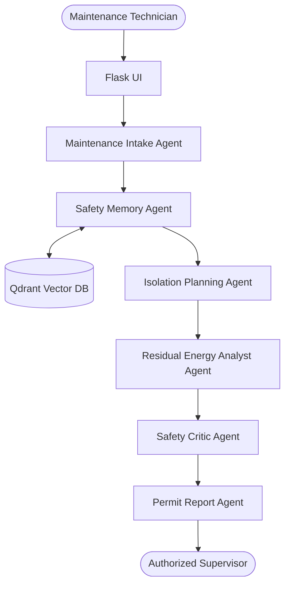
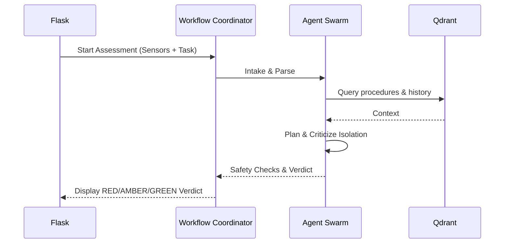

# ZERA AI
**Zero-Energy Release Assurance Agent**

*“Because switching off is not the same as proving zero energy.”*

## 🚧 Problem Statement
Industrial machines may retain hazardous stored energy even after the main power supply is switched off. Traditional Lockout/Tagout (LOTO) systems mainly verify whether workers completed a predefined checklist, relying heavily on human compliance and often missing latent risks like pressure rebound or gravity-induced descent.

## 💡 Proposed Solution
ZERA AI is an agentic decision-support layer that integrates sensor readings, retrieves machine-specific procedures and near-miss incidents, generates dynamic task-specific isolation plans, and performs rigorous deterministic safety checks to ensure zero-energy status before maintenance begins.

## 🔍 Existing-Solution Gap
Current digital LOTO solutions are glorified checklists. They lack real-time context-awareness, cannot synthesize historical incidents dynamically, and do not logically verify the coherence between physical sensor state and reported evidence.

## 🤖 Why Agentic?
ZERA AI utilizes a six-agent architecture to decompose the complex, multi-domain task of safety assurance. By separating planning, memory retrieval, residual energy analysis, and critical review into distinct agents, the system can self-correct, catch missing evidence, and enforce rigid safety thresholds deterministically while generating human-readable context.

## 🏗 Six-Agent Responsibilities
1. **Maintenance Intake Agent**: Parses request and validates scope.
2. **Safety Memory Agent**: Retrieves near-misses and LOTO procedures from Qdrant.
3. **Isolation Planning Agent**: Generates task-specific isolation plan.
4. **Residual Energy Analyst Agent**: Evaluates sensor readings deterministically.
5. **Safety Critic Agent**: Independently reviews findings and flags missing evidence.
6. **Permit Report Agent**: Generates the final verifiable report.

## 🏛 Architecture Diagram



## 🔄 Workflow Diagram



## 🛠 Technology Stack
- **Google ADK & Gemini**: Agent orchestration and reasoning
- **Qdrant**: Vector storage for semantic safety memory
- **Streamlit**: Interactive user dashboard
- **Pydantic**: Deterministic typing and data validation
- **Graphviz**: Dynamic energy hazard visualization
- **Python 3.11+**: Core backend logic

## 📦 Integration Usage
- **Google ADK**: Used to orchestrate the multi-agent workflow. Supports fallback to deterministic mode if API key is missing.
- **Gemini**: Powers generative capabilities for unstructured safety context analysis.
- **Qdrant Memory**: Used both locally and in the cloud to store and retrieve machine profiles, LOTO procedures, hazard catalogs, and incident histories.
- **Lyzr Integration (Optional)**: Can act as an additional supervisor layer (if configured).

## 🚀 Installation Instructions

```bash
git clone <repository-url>
cd zera-ai-agent
python -m venv .venv
```

**Windows:**
```powershell
.venv\Scripts\activate
```

**Linux/macOS:**
```bash
source .venv/bin/activate
```

```bash
pip install -r requirements.txt
```

## ⚙️ Environment Variable Setup

**Windows:**
```cmd
copy .env.example .env
```

**Linux/macOS:**
```bash
cp .env.example .env
```
Fill out the `.env` file with your API keys if applicable. The application functions completely in local deterministic mode without keys.

## ▶️ Running the Application

Seed the memory first:
```bash
python scripts/seed_qdrant.py
```

Run the dashboard:
```bash
streamlit run app.py
```

## 🧪 Testing
```bash
pytest -q
```
```bash
python scripts/run_demo.py
python scripts/health_check.py
```

## 🎬 Demo Scenarios
1. **Unsafe Hidden-Energy Condition (RED)**: Tests missing mechanical blocks and high hydraulic pressure.
2. **Corrected Isolation Condition (GREEN)**: Tests fully verified systems, rendering a "READY FOR AUTHORIZED HUMAN REVIEW" status.
3. **Pressure Rebound (RED)**: Tests detection of pressure decay followed by anomalous increase.

## 📸 Screenshots
*(Placeholders for UI screenshots)*
- `docs/screenshots/dashboard_red.png`
- `docs/screenshots/dashboard_green.png`

## ⚠️ Safety Limitations
**Prototype Disclaimer:** This software is a decision-support prototype. Mock limits are used for demonstration. The AI does not autonomously control machinery, open valves, or replace authorized safety professionals.

## 🔮 Future Enhancements
- Live PLC/SCADA sensor integration.
- Vision-based lock verification using multimodal LLMs.
- Active integration with enterprise CMMS software.

## 👥 Team
- Kishore J
- Monika Srinithi T

## 🙏 Acknowledgement
Built for the Google Advanced Agentic Coding Hackathon.

## 📄 License
MIT License
